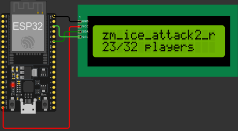

# ESP32A2SInformer



This project queries A2S-compatible game servers (such as Half-Life, Counter-Strike 1.6) and displays server information on an LCD display. The device connects via Wi-Fi and periodically fetches server data, including player count, map name, and bot count (if present). The information is displayed on a 16x2 LCD screen through the I2C interface.


## Requirements

* ESP32 board
* 16x2 LCD display with I2C interface
* Jumper wires to connect the LCD to the ESP32 board


## Wiring

| ESP32 Pin | LCD Pin |
| --------- | ------- |
| 5V        | VCC     |
| GND       | GND     |
| GPIO21    | SDA     |
| GPIO22    | SCL     |


## Setup

### 1. Install PlatformIO

Follow the instructions [here](https://platformio.org/install) to install PlatformIO for VS Code or CLI.

### 2. Clone the Repository

```bash
git clone https://github.com/hilorioze/ESP32A2SInformer.git
cd ESP32A2SInformer
```

### 3. Configure Wi-Fi and Server Address

Edit the [`src/main.cpp`](src/main.cpp) file to set your Wi-Fi credentials and the server address. Look at the following ready-to-use configuration example:

```cpp
// If no Wi-Fi credentials are provided, the device will connect to an open network
#define WIFI_SSID "Wokwi-GUEST"
#define WIFI_PASSWORD "" // Leave empty for open networks

#define SERVER_ADDRESS "46.174.48.101:27015" // Examples: 192.168.1.100, localhost:27015
```


## Running the Project

1. Open the project in VS Code or using the command line.

2. Connect the ESP32 board to your computer.

3. Build and upload the project to your ESP32 board using one of the following methods:
   - In VS Code, press `Ctrl + Alt + U`.
   - In the command line, run:
     ```bash
     platformio run --target upload
     ```

### Simulation **(Recommended)**

Alternatively, you can simulate the project without physical hardware using Wokwi.

[Wokwi](https://wokwi.com/) is the world's most advanced ESP32 simulator that lets you test the project without physical hardware.

#### Prerequisites

- Install the [Wokwi for VS Code](https://marketplace.visualstudio.com/items?itemName=wokwi.wokwi-vscode) extension by following the [setup guide](https://docs.wokwi.com/vscode/getting-started).

#### Run the Simulation

1. Open the project in VS Code.
2. Press `F1`, search for the "Wokwi: Start Simulator" command, and run it.
3. The simulation will launch in a new tab, showing the project in action.


## Contributing

Contributions are very welcome! If you are interested in improving this project, please feel free to fork the repository and submit a pull request. You can also open issues for any bugs or feature requests.


## License

This project is licensed under the MIT License. See the [LICENSE](LICENSE) file for details.
